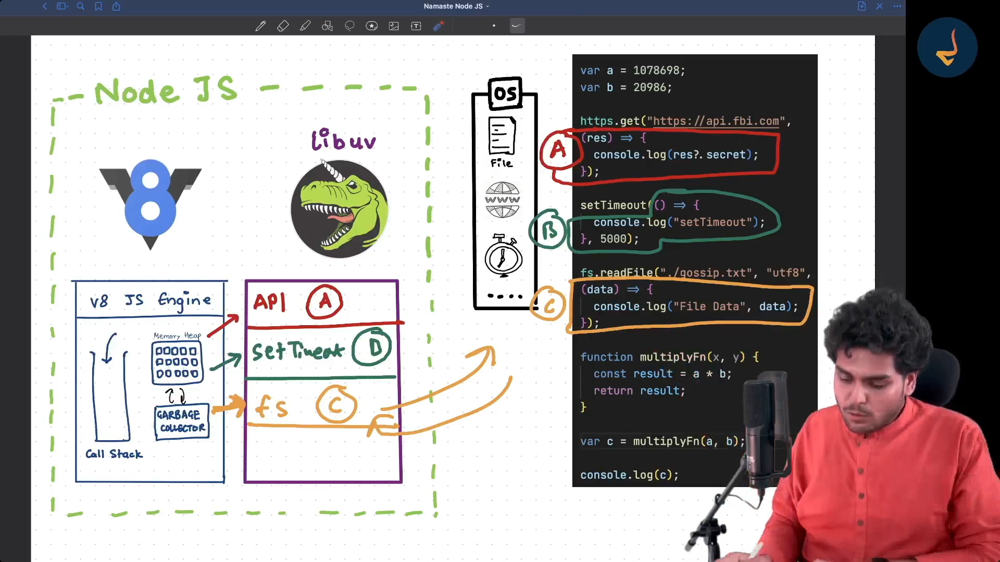

## JavaScript: Synchronous & Single-Threaded

- **Single-Threaded**  
  JavaScript has **one call stack** and executes code in a single thread.  
  This means it can run **one piece of code at a time**.

- **Synchronous Execution**  
  By default, JavaScript executes tasks **line-by-line** in the order they appear (top to bottom).  
  Each operation must complete before the next one starts.

---

### Why It Feels Asynchronous in Browsers or Node.js
- JavaScript itself is synchronous, but environments like **browsers** and **Node.js** provide:
  - **Web APIs** (e.g., `setTimeout`, DOM events, fetch API).
  - **Event Loop** & **Callback Queue** for scheduling async tasks.
- These allow JavaScript to handle I/O operations without blocking the main thread.

---

**Example (Synchronous Behavior)**:
```javascript
console.log("First");
console.log("Second");
console.log("Third");

// Output:
// First
// Second
// Third
```

# Node.js Event-Driven Architecture and Asynchronous I/O

## 1. Event-Driven Architecture

**Definition:**  
Node.js uses an **event loop** to handle operations. Instead of creating new threads for each task, it listens for events (like incoming requests, file operations finishing, etc.) and triggers **callback functions** when those events occur.

**How it works:**
1. Your program registers listeners for certain events.
2. When an event happens (e.g., “file read complete”), Node.js invokes the corresponding callback.

**Benefit:**  
Efficient handling of many concurrent connections without the overhead of multiple threads.

---

## 2. Asynchronous I/O

**Meaning:**  
In Node.js, most I/O functions (like reading from disk, making network requests, querying a database) are **non-blocking**.  
The call starts the I/O operation, but Node.js continues executing other code while waiting for it to finish.

**Why:**  
Node.js is single-threaded for JavaScript execution, so non-blocking I/O prevents the single thread from getting stuck waiting for slow operations.

---

## 3. Flow in Node.js

1. JavaScript code runs on a **single main thread**.
2. I/O operations are delegated to the **Node.js internals** (libuv & OS-level threads).
3. When the operation completes, the **event loop** picks up the result and calls your callback, `.then()` handler, or `await` continuation.

---

## Example

```javascript
const fs = require('fs');

console.log("Start reading file...");

fs.readFile('example.txt', 'utf-8', (err, data) => {
    if (err) throw err;
    console.log("File contents:", data);
});

console.log("This will run before the file is read!");
```

**Output order (demonstrating async I/O):**
```
Start reading file...
This will run before the file is read!
File contents: [actual file content]
```

### **Event Loop Workflow (Color-Coded)**

┌───────────────────────────────┐
│   JavaScript Code Execution   │
│    (Runs on Main Thread)      │
└───────────────┬───────────────┘
                │
                ▼
┌───────────────────────────────┐
│          Event Loop           │
└───────────────┬───────────────┘
                │
    ┌───────────┴───────────────┐
    │       libuv Thread Pool   │
    │ (Handles async I/O tasks) │
    └───────────┬───────────────┘
                │
                ▼
┌───────────────────────────────┐
│         Callback Queue        │
└───────────────┬───────────────┘
                │
                ▼
┌───────────────────────────────┐
│ Main Thread Executes Callbacks│
└───────────────────────────────┘


# Difference Between Synchronous and Asynchronous I/O

## 1. Synchronous I/O
- **Definition:** In synchronous I/O, a request (like reading/writing a file, making a network call, etc.) blocks the execution until the operation finishes.
- **Execution Flow:**
  - One task runs at a time.
  - The program waits for the I/O operation to complete before moving to the next line of code.
- **Analogy:** Imagine ordering food at a counter and standing there until your order is ready before doing anything else.
- **Pros:**
  - Easier to understand and debug.
  - Predictable execution order.
- **Cons:**
  - Can be slow for I/O-heavy programs because the CPU stays idle while waiting for I/O to complete.

**Example (JavaScript, synchronous file read):**
```javascript
const fs = require("fs");
const data = fs.readFileSync("file.txt", "utf-8");
console.log(data); // This runs only after file reading is done
```

---

## 2. Asynchronous I/O
- **Definition:** In asynchronous I/O, the request is initiated, but the program does not wait for it to finish; it continues executing other tasks. When the I/O is done, a callback, promise, or event is triggered.
- **Execution Flow:**
  - Multiple operations can be in progress at the same time.
  - The main thread does not block; the I/O happens in the background.
- **Analogy:** Ordering food at a counter, then sitting down and chatting while they prepare it. When it’s ready, they call your name.
- **Pros:**
  - Better performance for I/O-heavy operations.
  - Can handle many requests without blocking.
- **Cons:**
  - More complex to write and debug due to callbacks, async/await, etc.
  - Execution order may not be predictable without proper handling.

**Example (JavaScript, asynchronous file read):**
```javascript
const fs = require("fs");
fs.readFile("file.txt", "utf-8", (err, data) => {
    if (err) throw err;
    console.log(data); // Runs when file reading finishes
});
console.log("Reading file..."); // Runs immediately
```

---

## Quick Comparison Table

| Feature               | Synchronous I/O            | Asynchronous I/O               |
|-----------------------|----------------------------|---------------------------------|
| **Blocking**          | Blocks execution           | Non-blocking                    |
| **Speed**             | Slower for I/O-heavy tasks | Faster for I/O-heavy tasks      |
| **Execution Order**   | Sequential & predictable   | Not strictly sequential         |
| **Ease of Use**       | Easier to code/debug       | More complex (callbacks/promises)|
| **CPU Utilization**   | Can be idle while waiting  | CPU stays busy with other tasks |


# libuv in Node.js

## 1. What is libuv?

**Definition:**  
libuv is a **C library** that Node.js uses to handle **asynchronous I/O operations**.

**Role:**  
It provides the **event loop**, **thread pool**, and cross-platform abstractions for things like file system access, network operations, timers, etc.

**Why needed:**  
JavaScript in Node.js runs on a **single thread**, but libuv uses **non-blocking I/O** and **background threads** to prevent blocking.

---

## 2. Responsibilities of libuv

### Event Loop Management
- Maintains the main loop that continuously checks for pending events and callbacks to execute.

### Asynchronous I/O
- Offloads I/O tasks to the OS or to its own thread pool when the OS can’t handle them asynchronously (like file system operations).

### Thread Pool
- By default, **4 threads** (`UV_THREADPOOL_SIZE` can change this) handle tasks like DNS lookups, file reads/writes, crypto, compression, etc.

### Cross-Platform Support
- Works on Linux, macOS, Windows without you needing to care about OS differences.

### Timers & Polling
- Handles `setTimeout` / `setInterval`, socket polling, etc.

---

## 3. How It Fits in Node.js Architecture

```
JavaScript Code
    ↓
V8 Engine (executes JS)
    ↓
Node.js Core API
    ↓
libuv (C library)
    ├─ Event Loop
    ├─ Thread Pool
    ├─ Async I/O APIs
    └─ OS System Calls
```

---

## 4. Example in Action

When you run:

```javascript
fs.readFile("file.txt", "utf-8", callback);
```

1. JavaScript calls **Node.js’s fs module**.
2. fs module calls **libuv**, which puts the file read in the **thread pool**.
3. While the file is being read, the **event loop** continues running other JS code.
4. When the read completes, **libuv** signals the event loop to call your callback.

---

## 5. Why libuv is Important

- Without libuv, Node.js wouldn’t be able to do **non-blocking I/O** efficiently.
- It’s what allows **one thread** to handle **thousands of concurrent connections**.



