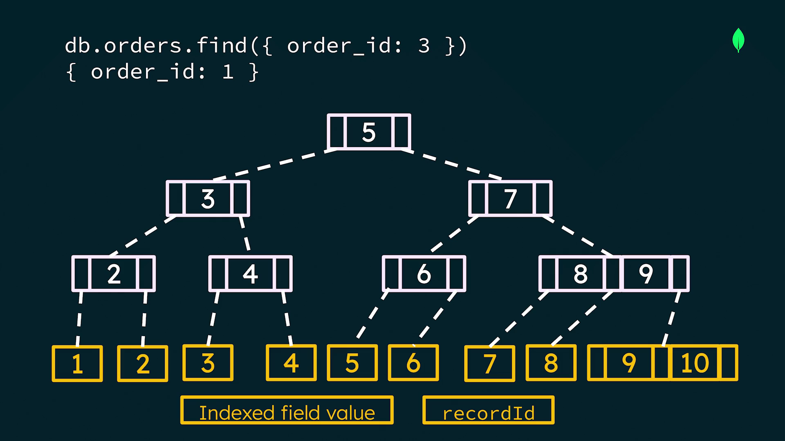
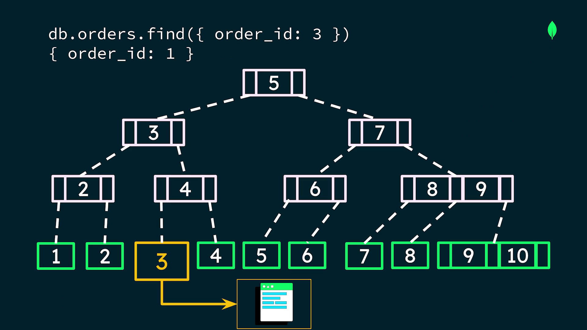
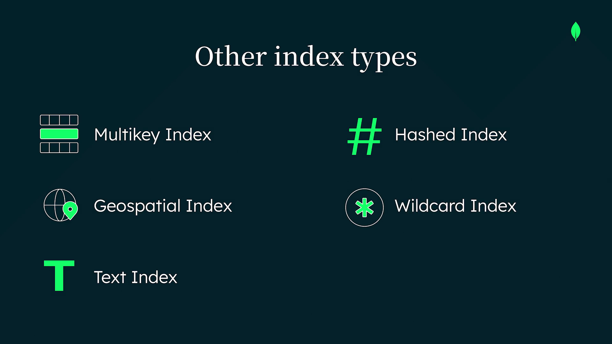
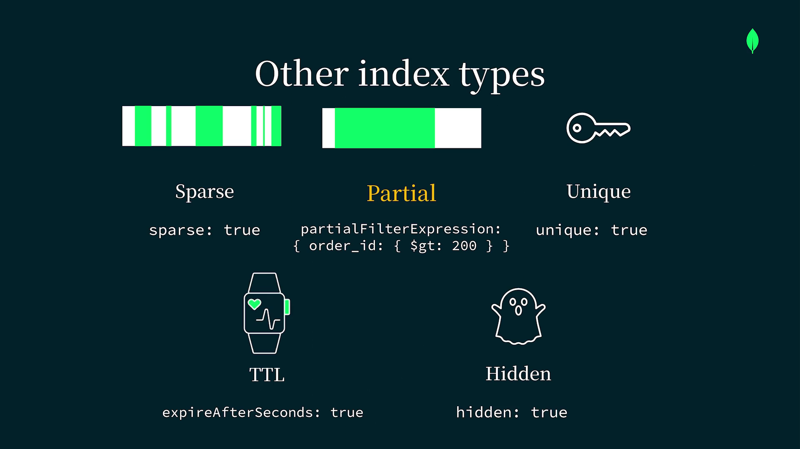

# What is Indexing ?

- Indexing is a data structure technique that improves the speed of data retrieval operations on a database at the cost of additional writes and storage space to maintain the index data structure. 

- In MongoDB, indexes are used to optimize query performance by allowing the database to quickly locate and access the relevant documents based on the indexed fields.

## What is an Index ?

Indexes are 
- `special data structures` that 
- store a `small portion of a collection's data` in 
- `ordered format` that is 
- optimized for `fast search`.

## But why should you use indexes?

Consider an orders collection without any indexes. 
If we wanna find a document that contains a specific order ID, MongoDB has to search every document in the collection to find it. This is known as a `collection scan`. 

**Why is this a problem?**

- Searching every document in a collection is time consuming.
- Performing a collection scan will slow down read operations and negatively impact performance.

**How indexing solves this problem ?**

- If we add an index on the order ID field, we can use the index to efficiently retrieve the documents we need instead of scanning the entire collection.

- Indexing will be done by B+ Tree.(rememeber File Organization and DBMS(chapter-5)).

- When a B+ tree is used to build an index, it consists of `internal nodes` that contain `keys` that help the database quickly traverse the index and `leaf nodes` that are the `endpoint of the structure`.

- When an `index` is selected for a query, the database traverses the index starting at the `root` of the tree, then follows the `pointers` in the `internal nodes down to the leaf nodes`. `The leaf nodes of the B+ tree contain keys that represent the index field value and record IDs for the actual document or documents that contain that value`.

- Think of this record ID as a shortcut to where the document is stored. Once you find the leaf node, you can access the document.




- This is an example of a `simple equality` match, but `indexes` can help `optimize range` and `sort operations` too.

## Indexes and Memory Usage in MongoDB

- Memory is a limited and valuable resource, so it must be used efficiently.
- During a collection scan, MongoDB loads every document from the collection into memory.
- As the collection size grows, collection scans degrade system performance.
- Indexes reduce memory usage by:
    - Loading only the relevant portion of the index into memory.
    - Fetching only the matching documents, not the entire collection.
- This makes queries faster and more memory-efficient.

## Types of Indexes

1. `Single Field Indexes`(most common) - index on values for one field.
2. `Compound Indexes` - index on two or more fields.





## Creating Indexes in MongoDB

- Indexes are created using the **`createIndex`** command.
- You can create indexes using:
  - `MongoDB Atlas Data Explorer`
  - `Atlas CLI`
  - `MongoDB Shell (`mongosh`)`
  - `MongoDB Drivers (Node.js, Java, Python, etc.)`

---

### Example: Creating an Index

### Single Field Index
```js
db.orders.createIndex({ customerId: 1 })
```

### Compund Index
```js
db.orders.createIndex({ customerId: 1, orderDate: -1 })
```

But before you start creating indexes for all of your queries, it's important to be aware of the associated cost.

## Cost of Indexes

- Indexes are not free.
- Each index:
    - Consumes additional disk space
    - Uses extra memory (RAM)
- Adds overhead to write operations (insert, update, delete)
- Creating too many indexes can degrade performance.
- Indexes should be created only for frequently used and performance-critical queries.

## Trade-offs of Indexing

- Indexes improve the performance of read operations at the cost of write operations.
- Database must update index entries on write operations.
- Indexes consume additional disk space.

**to mitigate these costs , we need to manage index lifecycle**

## Manage Index LifeCycle

- Identify key workloads for a collection.
- Create Minimum number of indexes.
- Monitor our indexing strategy and iterate as necessary.


      

