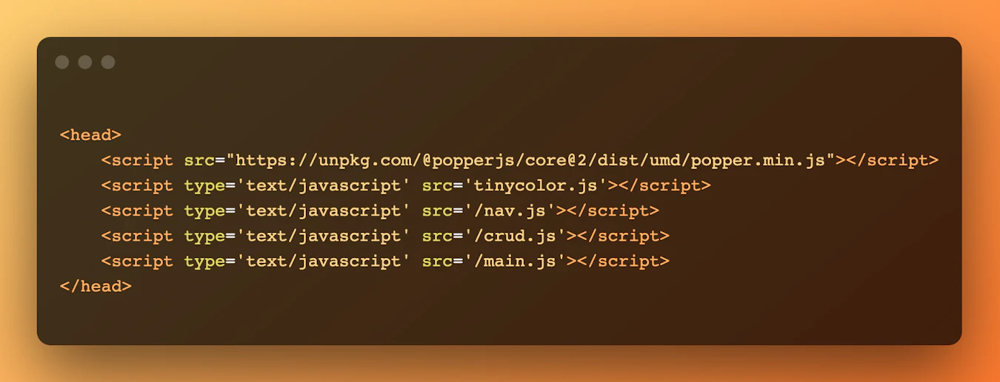
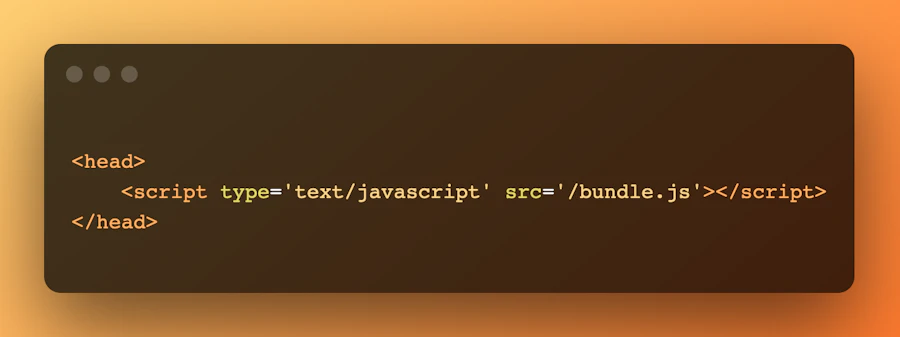

## Javascript Module Bundlers

- Module bundlers are the way to organize and combine many files of JavaScript code into one file. 

- A JavaScript bundler can be used when your project becomes too large for a single file or when you're working with libraries that have multiple dependencies.

## What is a JavaScript Module Bundler?

- A bundler is a development tool that combines many JavaScript code files into a single one that is production-ready loadable in the browser. 

- A fantastic feature of a bundler is that it generates a dependency graph as it traverses your first code files. 

- This implies that beginning with the entry point you specified, the module bundler keeps track of both your source files’ dependencies and third-party dependencies. This dependency graph guarantees that all source and associated code files are kept up to date and error-free.

## What Problem Does the Bundlers Solve ?

- Consider a basic JavaScript CRUD (Create, Read, Update, and Delete) app like a grocery list. 

- In the pre-bundler era, you might have constructed these functions in separate JS files. You could even opt to make your app a little more fancy by incorporating third-party libraries, and this would need your file to make several queries upon loading, like in this example.



- However,` using a bundler will merge the files and their dependencies into a single file`.



- Suppose you’re developing or maintaining a large app like an e-commerce site that provides access to thousands of products to several users. For a use case like this, you most likely will need to employ custom or third-party libraries to power some of your more complex tasks. 

- In that case, developing without a JavaScript module bundler would make keeping all the `dependencies updated to the latest version an exhaustive process.`

- Apart from providing a `consistent tooling environment` that saves you from the pain of dependencies, many popular module bundlers also come with `performance optimization `features. 

- `Code splitting` and `hot module replacement` are examples of these functionalities. JavaScript bundlers also have productivity-enhancing features such as `robust error logging`, which lets developers easily debug and repair errors.

## How Does a Bundler Work ?

### Step I : Mapping a Dependency Graph

- The first thing a module bundler does is generate a relationship map of all the served files. This process is called `Dependency Resolution`. 

- To do this, the bundler requires an entry file which should ideally be your main file. It then parses through this entry file to understand its dependencies.

- Following that, it traverses the dependencies to determine the dependencies of these dependencies. Tricky, eh? It` assigns unique IDs to each file it sees throughout this process`. 

- Finally, `it extracts all dependencies and generates a dependency graph that depicts the relationship between all files`.

#### Why is this process necessary?

- It enables the module to construct a dependency order, vital for retrieving functions when a browser requests them.

```js
return {  id,  filename,  dependencies,  code,  };
```

- It prevents naming conflicts since the JS bundler has a good source map of all the files and their dependencies.

- It detects unused files allowing us to get rid of unnecessary files.


### Step II : Bundling

- After receiving inputs and traversing its dependencies during the Dependency Resolution phase, a bundler delivers static assets that the browser can successfully process. This output stage is called `Packing`. 

- During this process, the bundler will leverage the dependency graph to integrate our multiple code files, inject the required function and module.exports object, and return a single executable bundle that the browser can load successfully.

### Some Examples of JS Module Bundlers and Their Working 

- I will go deep only for Vite.js(I prefer and use mostly in my projects) other ones will only get honorary mentions.

### Vite.js

- Vite.js is a next-generation, open-source frontend building tool. 

- `Vue.js` creator` Evan You` created Vite.js in `2020` to enhance the bundling ecosystem by `exploiting the latest ES modules improvements` to solve some of the building performance issues prior bundlers encountered. 

- Currently, Vite.js has over 78.6k stars on Github and has over million downloads every week.

#### How Does It Work?

- One of Vite.js's unique features is that it comes with a `dev server and a bundling build command`. 

- The `Dev server` parses your application modules and separates them into `two groups`: The dependencies which are mostly` not frequently updated are pre-bunded using esbuild`, a JavaScript bundler that's extremely faster than Webpack, Rollup, and Parcel. 

The application source code's other group requires frequent updates and is `served on-demand` without bundling to the browser `leveraging the browser's powerful ESM module capability`. 

- On the other hand, the build command bundles your code using `Rollup`, a JS bundler. 

- Vite.js starts from an entry point when traversing your codebase to convert them into production-ready static assets. Like `several other JS bundlers, Vite.js also supports multiple entry points`.

```js
// vite.config.js
const { resolve } = require('path')
const { defineConfig } = require('vite')
 
module.exports = defineConfig({
 build: {
   rollupOptions: {
     input: {
       main: resolve(__dirname, 'index.html'),
       nested: resolve(__dirname, 'nested/index.html')
     }
   }
 }
})

```
#### Pros 

- Lean and Fast
    
    - By leveraging the Native ES6 module system, `Vite.js can serve application code faster by reducing the number of browser requests it makes`. 

    - That's not all. Vite.js also comes with `Hot Module Replacement (HMR), making editing a quicker, near-instant process`. 

- Multi-Framework Support 

    - Vite.js is `framework-agnostic` with out-of-box support for many popular  Javascript frameworks like React.js, Vue.js, Typescript, and Preact.
    
    - Recent releases have also integrated `support for CSS modules`, pre-processors, and other static assets. For example, you can quickly set up a Vue.js app with Vite using the following command:
        
        `npm init vite@latest my-vue-app -- --template vue`
`
- It also has a `rich plugin ecosystem` that leverages other bundlers like `esbuild `and `Rollup` plugin ecosystems to provide developers with an extensive set of options.


#### Cons

- Reliance on ESM Modules

- Vite.js heavily relies on the browser's native ESM system to produce the mindblowing speed it's known for. This means developers `might run into issues when dealing with older browsers that don't support these upgrades`.


### Some Other Bundlers

    - Webpack
    - Browserify
    - Parcel
    - Fusebox
    - Rollup